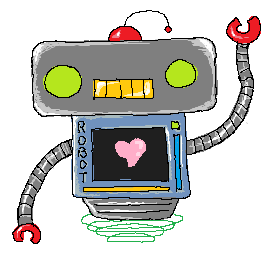

# **Jesture** - The Coolest Hand-Waving Game Ever Made!

  

**Jesture** is a magical gesture-based drawing experience where your hands become the paintbrush! Wave your arms about like you're conducting an invisible orchestra, and watch as your beautiful (or hilariously terrible) art manifests on your screen!  

## Features

- **Single-player Mode**: Just you and your robot friend! Draw something and watch as the smartest robot in the world tries to guess what your scribbles mean!

- **Multiplayer Mode**: Challenge a friend to a drawing duel! The AI will judge whose masterpiece is the least confusing!

- **Gesture Controls**: Close your fist to draw, open to stop!

## Required Files

Make sure you have `gesture_recognizer.task`. This is thee model that reads your hand gestures.

## Simple Startup


```bash
# Install the dependencies
pip install mediapipe opencv-python pyray numpy pillow google-genai

# Run the game and prepare for artistic greatness
python main.py

# For single-player 
python main.py --mode single

# For multiplayer 
python main.py --mode multi 
# You can use -t to set the amount of time per round 
# (by default this is 30 seconds)
```

## Controls

- **Make a Fist**: Draw on the screen

- **Q**: Quit 

### Single-player Mode

- **F**: Free drawing mode 

- **L**: Line mode (make a fist to start, open hand to end)

- **C**: Circle mode (make a fist at the center, open hand to set radius)

- **1-4**: Change colors (1=Black, 2=Red, 3=Blue, 4=Green)

- **UP/DOWN**: Adjust brush size for thick or thinner strokes

- **X**: Clear the canvas 

- **G**: Make the robot guess what you've drawn 

### Multiplayer Mode

- **SPACE**: Start a new drawing battle 

- **R**: Play again 

# Bitcamp 2025: Best Use of Gemini API

